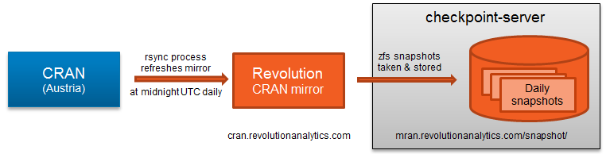
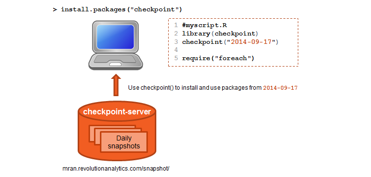

# The Reproducible R Toolkit (RRT)

The **Reproducible R Toolkit** provides tools to ensure the results of R code are repeatable over time, by anyone. Most R scripts rely on packages, but new versions of packages are released daily. To ensure that results from R are reproducible, it's important to run R scripts using exactly the same package version in use when the script was written.

The Reproducible R Toolkit provides an R function checkpoint, which ensures that all of the necessary R packages are installed with the correct version. This makes it easy to reproduce your results at a later date or on another system, and makes it easier to share your code with the confidence that others will get the same results you did.

The Reproducible R Toolkit also works in conjunction with the "checkpoint-server", which makes a daily copy of all CRAN packages, to guarantee that every package version is available to all R developers thereby ensuring reproducibility.

## Components of RRT

RRT is a collection of R packages and the checkpoint server that together make your work with R packages more reproducible over time by anyone.

### The checkpoint server

To achieve reproducibility, daily snapshots of CRAN are stored on our checkpoint server. At midnight UTC each day, we refresh our mirror of [CRAN](https://cran.r-project.org/) is refreshed. When the rsync process is complete, the checkpoint server takes and stores a snapshot of the CRAN mirror as it was at that very moment. These daily snapshots can then be accessed on the [MRAN website](https://mran.microsoft.com/snapshot) or using the `checkpoint` package, which installs and consistently use these packages just as they existed at midnight UTC on a specified snapshot date. Daily snapshots are available as far back as `2014-09-17`. For more information, visit the [checkpoint server GitHub site](https://github.com/RevolutionAnalytics/checkpoint-server).



### The checkpoint package

The goal of the `checkpoint` package is to solve the problem of package reproducibility in R. Since packages get updated on CRAN all the time, it can be difficult to recreate an environment where all your packages are consistent with some earlier state. To solve this issue, `checkpoint` allows you to install packages locally as they existed on a specific date from the corresponding snapshot (stored on the checkpoint server) and it configures your R session to use only these packages. Together, the `checkpoint` package and the checkpoint server act as a CRAN time machine so that anyone using `checkpoint()` can ensure the reproducibility of their scripts or projects at any time.




# Using checkpoint

Using `checkpoint` is simple:

- `checkpoint` has only a single function, `checkpoint()` where you specify the snapshot date.

## Using the checkpoint function

When you create a checkpoint, the `checkpoint()` function:

- Creates a snapshot folder to install packages. This library folder is located at `~/.checkpoint`
- Scans your project folder for all packages used. Specifically, it searches for all instances of `library()` and `require()` in your code.
- Installs these packages from the MRAN snapshot into your snapshot folder using `install.packages()`
- Sets options for your CRAN mirror to point to a MRAN snapshot, i.e. modify `options(repos)`

This means the remainder of your script will run with the packages from a specific date.


## Sharing your scripts for reproducibility

Sharing your script to be reproducible is as easy as:

- Load the `checkpoint` package using `library(checkpoint)`
- Ensure you specify `checkpoint()` with your checkpoint date, e.g. `checkpoint("2014-09-17")`

Then send this script to your collaborators.  When they run this script on their machine, `checkpoint` will perform the same steps of installing the necessary packages, creating the `checkpoint` snapshot folder and producing the same results.


## Resetting the checkpoint

To reset the checkpoint, simply restart your R session.


## Worked example

To create a checkpoint project, you do:

1. Create a new folder and change your working directory to this folder.  If you use an IDE like RStudio, this is identical to creating a new RStudio project.
2. Add your R script files to this folder.
3. Add a checkpoint to the top of the script:

    ```r
    library(checkpoint)
    checkpoint("2015-04-26", checkpointLocation = tempdir())
    ```

4. Run the script.

### Create a checkpoint project

For example, your script may look like this:

```r
library(checkpoint)
checkpoint("2015-04-26", checkpointLocation = tempdir())

library(MASS)
hist(islands)
truehist(islands)
```


### Run the checkpoint code

Next you want to run the script.  Here is what `checkpoint` does:


```{r setup, include=FALSE}

## Create temporary project and set working directory

example_project <- tempdir()

dir.create(example_project, recursive = TRUE, showWarnings = FALSE)
oldRepos <- getOption("repos")
oldLibPaths <- .libPaths()


## Write dummy code file to project

example_code <- '
library(checkpoint)
checkpoint("2015-04-26", checkpointLocation = tempdir())

library(MASS)
hist(islands)
truehist(islands)
'

cat(example_code, file = file.path(example_project, "checkpoint_example_code.R"))

```

```{r checkpoint, warning=FALSE}
## Create a folder to contain the checkpoint
## This is optional - the default is to use ~/.checkpoint

dir.create(file.path(tempdir(), ".checkpoint"), recursive = TRUE)

## Create a checkpoint by specifying a snapshot date

library(checkpoint)
checkpoint("2017-04-01", project = example_project, checkpointLocation = tempdir())
```

### Inspecting the results

Now inspect the results. First, check that your CRAN mirror is set to MRAN snapshot:


```{r inspect-1}
getOption("repos")
```


Next, check that the library path is set to `~/.checkpoint`:

```{r inspect-2}
normalizePath(.libPaths(), winslash = "/")
```

Finally, check which packages are installed in checkpoint library:

```{r inspect-3, eval=FALSE}
installed.packages(.libPaths()[1])[, "Package"]
```


```{r cleanup, include=FALSE}
## cleanup

unlink(example_project, recursive = TRUE)
unlink(file.path(tempdir(), "checkpoint_example_code.R"))
unlink(file.path(tempdir(), ".checkpoint"), recursive = TRUE)
options(repos = oldRepos)
unCheckpoint()
```
